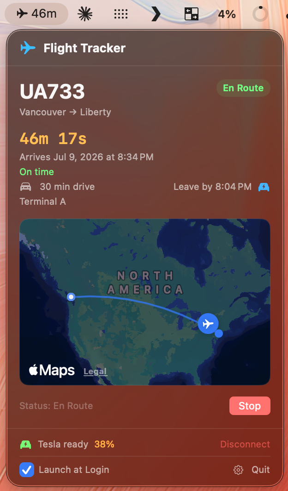

# FlightMenuBar

A macOS menu bar app that tracks a live flight and automatically sends GPS navigation to your Tesla when it's time to leave for the airport — so you never miss a pickup.

<p align="center">
  
</p>

---

## Features

- **Live flight tracking** — enter any flight number and get real-time status, arrival countdown, delay info, and en-route / landed status via AeroDataBox
- **Live aircraft position** — shows the plane on a great-circle map with a heading-accurate icon, refreshed every 30 seconds via OpenSky Network
- **Driving time & leave-by reminder** — calculates drive time from your current location to the arrival airport using MapKit, and displays a "Leave by" time
- **Bark push notification** — fires a push notification to your iPhone at exactly the leave-by moment (15 min before you need to leave)
- **Tesla navigation** — sends GPS coordinates of the arrival terminal directly to your Tesla at leave-by time via the Fleet API signed-command protocol; or trigger it manually with one click
- **Tesla setup wizard** — in-app OAuth login, virtual key generation and hosting, partner registration, and key-add flow
- **Menu bar countdown** — shows `✈ 2h 14m` in the menu bar with colour coding (green = on time, orange = delayed, red = >1h late)
- **Launch at Login** — one checkbox to enable, powered by `SMAppService`

---

## Requirements

| Requirement | Details |
|---|---|
| macOS | 13 Ventura or later |
| Xcode | 15 or later (to build from source) |
| [AeroDataBox API key](https://rapidapi.com/aedbx-aerodatabox) | Free tier covers personal use |
| [AeroAPI key](https://www.flightaware.com/aeroapi/portal/) (optional) | Adds live delay data — Personal tier includes $5/month free usage |
| [Bark iOS app](https://apps.apple.com/app/bark-customed-notifications/id1403753865) | For iPhone push notifications |
| Tesla account + Fleet API app | Register at [developer.tesla.com](https://developer.tesla.com) |
| A domain to host your Tesla public key | e.g. a free Vercel project |

---

## Installation

### 1. Clone the repo

```bash
git clone https://github.com/ryopang/flight-menu-bar.git
cd flight-menu-bar
```

### 2. Create your secrets file

```bash
cp FlightMenuBar/Config.secret.swift.template FlightMenuBar/Config.secret.swift
```

Open `Config.secret.swift` and fill in your values:

```swift
enum Secrets {
    static let rapidAPIKey        = "YOUR_RAPIDAPI_KEY"
    static let aeroAPIKey         = ""   // optional — FlightAware AeroAPI for live delays
    static let barkDeviceToken    = "YOUR_BARK_DEVICE_TOKEN"
    static let teslaClientID      = "YOUR_TESLA_CLIENT_ID"
    static let teslaClientSecret  = "YOUR_TESLA_CLIENT_SECRET"
    static let teslaKeyServerDomain = "yourdomain.vercel.app"
}
```

> `Config.secret.swift` is gitignored and will never be committed.

### 3. Build & run

Open `FlightMenuBar.xcodeproj` in Xcode, select the **FlightMenuBar** scheme, and press **⌘R**.

Or build from the command line:

```bash
xcodebuild -project FlightMenuBar.xcodeproj -scheme FlightMenuBar -configuration Release build
```

---

## Setup Guide

### AeroDataBox (flight data)

1. Sign up at [RapidAPI](https://rapidapi.com/aedbx-aerodatabox)
2. Subscribe to **AeroDataBox** — the free tier is sufficient for personal use
3. Copy your API key into `Secrets.rapidAPIKey`

### FlightAware AeroAPI (optional — live delay data)

AeroDataBox sometimes has schedule-only records with no live status. With an
AeroAPI key configured, the app overlays FlightAware's live estimated arrival,
delay, and status on every lookup.

1. Sign up at the [AeroAPI portal](https://www.flightaware.com/aeroapi/portal/)
2. Choose the **Personal** tier — includes $5/month of free usage (a lookup
   costs $0.005, so personal polling stays well under the cap)
3. Copy the key into `Secrets.aeroAPIKey` (leave `""` to disable)

### Bark (iPhone push notifications)

1. Install [Bark](https://apps.apple.com/app/bark-customed-notifications/id1403753865) on your iPhone
2. Open the app — your device token is shown on the home screen
3. Copy it into `Secrets.barkDeviceToken`

### Tesla Fleet API

Tesla requires a registered developer app and a hosted public key.

#### Step 1 — Register your app

1. Go to [developer.tesla.com](https://developer.tesla.com) and create an application
2. Set **Allowed Origin** to `https://yourdomain.vercel.app/`
3. Set **Allowed Redirect URI** to `flightmenubar://auth/callback`
4. Enable the **Fleet API** scope
5. Copy the **Client ID** and **Client Secret** into `Secrets.teslaClientID` / `Secrets.teslaClientSecret`

#### Step 2 — Host your public key

The app generates a P-256 key pair. The public key must be hosted at:

```
https://yourdomain.vercel.app/.well-known/appspecific/com.tesla.3p.public-key.pem
```

In the app's Tesla setup wizard:

1. Click **Generate Key** — the PEM is shown and can be copied
2. Save it to `public/.well-known/appspecific/com.tesla.3p.public-key.pem` in your Vercel project and deploy
3. Set `Secrets.teslaKeyServerDomain = "yourdomain.vercel.app"`

#### Step 3 — Add the virtual key to your car

1. Click **Open tesla.com/_ak link** in the setup wizard — the app first registers with Tesla's Fleet API backend, then opens the key-add page
2. Scan the QR code with the Tesla mobile app and tap **Add**
3. Back in the wizard, click **I've added the key ✓**

---

## Usage

1. Click the `✈` icon in the menu bar
2. Type a flight number (e.g. `UA1597`) and press **Track**
3. The app polls every 20 minutes for updates and recalculates driving time
4. At leave-by time (drive time + 15-minute buffer before arrival), you'll receive:
   - A macOS notification
   - A Bark push to your iPhone
   - Automatic GPS navigation sent to your Tesla
5. You can also tap the **⚡ bolt icon** next to the leave-by time to send Tesla navigation immediately

---

## Architecture

| File | Responsibility |
|---|---|
| `FlightMenuBarApp.swift` | App entry point, `NSApplicationDelegate` for URL scheme callbacks |
| `AppState.swift` | Central `ObservableObject`; polling timers, leave-by task scheduling |
| `FlightService.swift` | AeroDataBox flight lookup + FlightAware AeroAPI live overlay + OpenSky real-time position |
| `DrivingService.swift` | MapKit driving time calculation |
| `TeslaService.swift` | Tesla OAuth, virtual key setup, partner registration, navigation |
| `TeslaCommandSigner.swift` | ECDH + HKDF + AES-GCM signed command protocol |
| `TeslaProto.swift` | Minimal protobuf encoder/decoder for Tesla's command wire format |
| `NotificationManager.swift` | macOS `UNUserNotificationCenter` leave-by notification |
| `BarkService.swift` | Bark HTTP push to iPhone |
| `KeyManager.swift` | P-256 key generation and Keychain storage |
| `FlightMapView.swift` | `MapKit` great-circle route with live aircraft position |
| `MenuBarView.swift` | Main SwiftUI popover UI |

---

## Privacy

- No data is sent to any server other than AeroDataBox, OpenSky, Tesla Fleet API, and your own Bark server
- All credentials are stored in `UserDefaults` (access tokens) or the macOS Keychain (private key)
- The app has no analytics, no crash reporting, and no third-party SDKs

---

## Changelog

### v1.3.0 — 2026-07-04
- **Flight map always visible** — the map now shows the route as soon as a flight is tracked, even before departure. Fixes cases where AeroDataBox omits airport coordinates by falling back to a built-in IATA dictionary (35 major US airports) then CLGeocoder.
- **Tesla battery %** — charging level appears next to "Tesla ready" in the footer (green/orange/red color coding). Fetched on connect and refreshed every 5 minutes while tracking.

### v1.2.0 — 2026-07-04
- **FlightAware AeroAPI integration** — live estimated arrival, real delay minutes, and accurate status (Delayed, En Route, Landed) overlay on top of AeroDataBox. Falls back gracefully when no key is configured.
- Fix: no longer shows a false "On time" badge when the API only has schedule-only data; shows "Scheduled time — no live updates yet" instead.

### v1.1.0 — 2026-07-01
- Aircraft heading now computed from departure airport → current GPS position (great-circle bearing), replacing the unreliable OpenSky `true_track` field which is frequently null.
- Tesla partner account registration (`POST /api/1/partner_accounts`) wired in before opening the `_ak` virtual key link — fixes "Unable to Grant Third-Party Access" error on first Tesla setup.
- Manual Tesla navigation button added next to the leave-by time.
- Bark leave-by notification fires at leave-by time (−15 min buffer before arrival).

### v1.0.0 — 2026-06-15
- Initial release: flight tracking, live map, driving time, leave-by alarm, Tesla navigation, Bark push, Launch at Login.

---

## License

MIT — do whatever you want with it.
